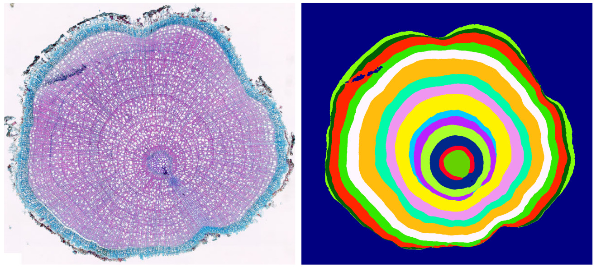

# INBD
灌木横截面显微图像中树轮实例分割的迭代边界检测

CVPR 2023. [链接](https://openaccess.thecvf.com/content/CVPR2023/html/Gillert_Iterative_Next_Boundary_Detection_for_Instance_Segmentation_of_Tree_Rings_CVPR_2023_paper.html)

***



***

## 环境设置:

使用python3.7版本

```bash
#创建虚拟环境，导入环境文件
conda create -name ibnd python=3.7
conda env create -f environment.yml

#下载数据集
python fetch_dataset.py

#下载预训练模型
python fetch_pretrained_models.py
```

Or use GitHub Codespaces: [](https://github.com/codespaces/new?hide_repo_select=true&ref=dev&repo=574937325&machine=standardLinux32gb&location=WestEurope)

***


## 预测

```bash
#对单个原始图像进行处理
python main.py inference checkpoints/INBD_EH/model.pt.zip dataset/EH/inputimages/EH_0033.jpg

#对批量图像进行处理
python main.py inference checkpoints/INBD_EH/model.pt.zip dataset/EH/test_inputimages.txt
```

***


## 训练模型:


```bash
#首先，训练三类分割模型
python main.py train segmentation           \
  dataset/EH/train_inputimages.txt          \
  dataset/EH/train_annotations.txt

#接下来，训练INBD网络
python main.py train INBD \
  dataset/EH/train_inputimages.txt          \
  dataset/EH/train_annotations.txt          \
  --segmentationmodel=checkpoints/segmentationmodel/model.pt.zip   #adjust path
```


***

## 数据集

我们引入一个新的公开可用的数据集：MiSCS（显微灌木横截面图像）

数据集和注释可以通过运行 python fetch_dataset.py 脚本来下载，或者通过以下链接下载：:
- [DO (Dryas octopetala)](https://github.com/alexander-g/INBD/releases/download/dataset_v1/DO_v1.zip)
- [EH (Empetrum hermaphroditum)](https://github.com/alexander-g/INBD/releases/download/dataset_v1/EH_v1.zip)
- [VM (Vaccinium myrtillus)](https://github.com/alexander-g/INBD/releases/download/dataset_v1/VM_v1.zip)


License for the source code: [MPL-2.0](https://github.com/alexander-g/INBD/blob/master/LICENSE)

License for the dataset: [CC BY-NC-SA 4.0](https://creativecommons.org/licenses/by-nc-sa/4.0/)


